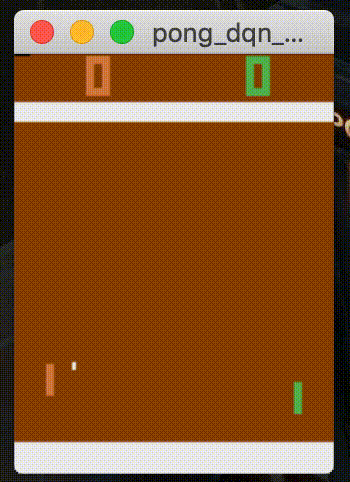
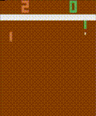

# Reinforcement learning for Openai-Gym

This repository contains models for Reinforcement Learning with [Openai Gym](https://gym.openai.com).

All models can be run from the commandline.

## Requirements

The recommended way to get the examples running is to install [conda](https://www.anaconda.com/) on your machine.

* atari-py
* click
* gym
* numpy
* pytorch
* scipy
* tensorboard
* torchvision

To create a new conda environment and install all the above requirements
you can use the following command:

    $ conda create -n myenv --file package-list.txt

## Pong

| Random agent | trained dqn agent |
|--------|--------|
|  | |